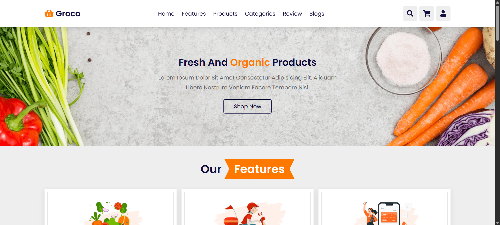

# 🛒 Grocery Store Website  
> A responsive and interactive grocery store web application built with HTML, CSS, and JavaScript.  

## 🖼 Screenshots 


<h3 align="center">
    🔹
    <a href="https://github.com/vishShivansh/GroceryStore/issues">Report Bug</a> &nbsp; &nbsp;
    🔹
    <a href="https://github.com/vishShivansh/GroceryStore/issues">Request Feature</a>
</h3>

### Connect With Me

<p align="start">
  <a href="https://www.linkedin.com/in/shivansh-gupta-54ba2a226" target="_blank">
    
  </a>
  &nbsp;
  <a href="https://www.instagram.com/vish._shivansh" target="_blank">
    
  </a>
  &nbsp;
  <a href="https://my-portfolio-shivansh-guptas-projects-acc2e36d.vercel.app" target="_blank">
    
  </a>
</p>

---

## 📑 Table of Contents  
- [About](#-about)  
- [Features](#-features)  
- [Tech Stack](#-tech-stack)  
- [Installation](#-installation)  
- [Usage](#-usage)  
- [Contributing](#-contributing)  
- [License](#-license)  
- [Author](#-author)  

---

## 📖 About  
**Grocery Store Website** is a fully responsive frontend project that provides users with an online shopping experience for groceries.  
It includes interactive product sliders, shopping cart functionality, customer reviews, categories, and a login system.  

---

## ✨ Features  
- 📱 Fully responsive design (desktop, tablet, mobile)  
- 🧾 Navigation menu with toggle  
- 🔍 Search bar with open/close animation  
- 🛒 Shopping cart with product preview & remove option  
- 👤 Login form modal  
- 🎞️ Product & customer review sliders (Swiper.js)  
- 🗂️ Categories section for browsing  
- 📰 Blog/news section with hover effects  

---

## 🛠 Tech Stack  
- **Frontend:** HTML5, CSS3, JavaScript  
- **Libraries/Plugins:** [Swiper.js](https://swiperjs.com/)  
- **Icons:** [Font Awesome](https://fontawesome.com/)  

---

## ⚙️ Installation  

```bash
# Clone the repository
git clone https://github.com/vishShivansh/GroceryStore.git

# Navigate into the project folder
cd GroceryStore

# Open in Live Server (Run this command to start the project with auto-reload)
npx live-server
```
👉 The project will open in your browser at:
http://127.0.0.1:8080

---

## 🚀 Usage  
1. Open `index.html` in your browser.  
2. Browse products, categories, and reviews.  
3. Add/remove items from the cart.  
4. Login form available for authentication demo.  

---

## 🤝 Contributing  
Contributions are welcome!  
1. Fork the repository  
2. Create your feature branch (`git checkout -b feature/NewFeature`)  
3. Commit your changes (`git commit -m 'Add NewFeature'`)  
4. Push to the branch (`git push origin feature/NewFeature`)  
5. Open a Pull Request  

---

## 📜 License  
Distributed under the MIT License. See `LICENSE` for more information.  

---

## 👨‍💻 Author  
- Shivansh Gupta (vishShivansh)
- [Portfolio](https://my-portfolio-shivansh-guptas-projects-acc2e36d.vercel.app)  
- [GitHub](https://github.com/vishShivansh)  
- [LinkedIn](https://www.linkedin.com/in/shivansh-gupta-54ba2a226)  
- [Instagram](https://www.instagram.com/vish._shivansh)  

### Show your support

Give a ⭐ if you like this website!

[](https://github.com/vishShivansh/GroceryStore/stargazers)